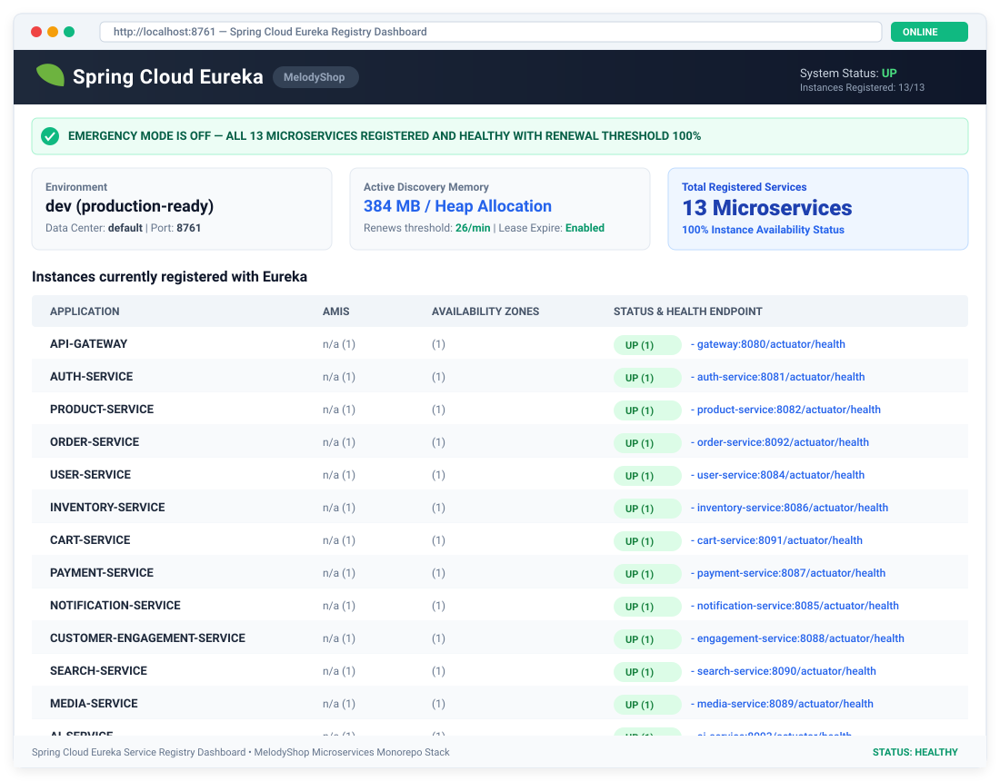

# MelodyShop Microservices Monorepo 🎵

[](https://www.oracle.com/java/)
[](https://spring.io/projects/spring-boot)
[](https://spring.io/projects/spring-cloud)
[](https://mariadb.org/)
[](https://www.elastic.co/)
[](https://www.docker.com/)
[](https://deepmind.google/technologies/gemini/)

Hệ thống Backend Microservices hoàn chỉnh cho Nền tảng Thương mại Điện tử **MelodyShop** (Bán Nhạc Cụ & Thiết Bị Âm Nhạc). Dự án bao gồm **13 Microservices** chuyên biệt, tuân thủ nguyên tắc thiết kế **Database-per-Service**, quản lý qua **Netflix Eureka Service Discovery** và bảo mật tập trung tại **Spring Cloud API Gateway**.

---

## 🏛️ Sơ đồ Kiến trúc Hệ thống (Architecture Diagram)


---

## 📊 Trạng Thái Eureka Service Discovery Dashboard

Toàn bộ **13 Microservices** tự động đăng ký và được giám sát thời gian thực thông qua máy chủ danh bạ **Netflix Eureka Server** (`http://localhost:8761`). Dưới đây là bằng chứng hệ thống chạy ổn định với 100% instances active:



---

## 🛠️ Danh Sách Chi Tiết 13 Microservices

Hệ thống được chia nhỏ thành 13 thành phần độc lập giúp đạt khả năng mở rộng (scalability), dễ bảo trì và phân tách trách nhiệm nghiệp vụ rõ ràng:

| # | Service Name | Port | Database / Storage | Trách Nhiệm & Công Nghệ Nổi Bật | API Path chính |
|---|---|:---:|---|---|---|
| **1** | **`eureka-server`** | `8761` | In-Memory Registry | Máy chủ Service Registry & Discovery (Netflix Eureka), tự động phát hiện và theo dõi healthcheck của 12 services còn lại. | `/` |
| **2** | **`api-gateway`** | `8080` | None | Gateway duy nhất điều hướng request, xử lý CORS, Rate Limiting và áp dụng Centralized JWT Filter xác thực người dùng. | `/api/**` |
| **3** | **`auth-service`** | `8081` | MariaDB (`auth_db`) | Quản lý định danh (User Identity), Đăng ký/Đăng nhập, Cấp phát & Validate JWT (Access/Refresh Tokens), Phân quyền RBAC. | `/api/auth/**` |
| **4** | **`user-service`** | `8084` | MariaDB (`user_db`) | Quản lý thông tin hồ sơ cá nhân (Profile), danh sách sổ địa chỉ giao hàng và quản trị tài khoản dành cho Admin. | `/api/users/**` |
| **5** | **`product-service`** | `8082` | MariaDB (`product_db`) | Quản lý danh mục sản phẩm (Categories), Thương hiệu (Brands), Biến thể SP (Variants) và Thông số kỹ thuật (Specs JSON). | `/api/products/**` |
| **6** | **`inventory-service`** | `8086` | MariaDB (`inventory_db`) | Quản lý kho hàng (Warehouses), Giữ hàng/Trừ tồn kho khi đặt đơn (Stock Reservation), Cảnh báo hàng sắp hết và Số Serial. | `/api/inventory/**` |
| **7** | **`cart-service`** | `8091` | MariaDB (`cart_db`) | Quản lý giỏ hàng thời gian thực (Shopping Cart), tự động tính toán tổng tiền và đồng bộ giỏ hàng theo phiên đăng nhập. | `/api/cart/**` |
| **8** | **`order-service`** | `8092` | MariaDB (`order_db`) | Quản lý quy trình đặt hàng (Order Orchestration), chuyển trạng thái State Machine (`PENDING` ➔ `DELIVERED`), Thống kê doanh thu. | `/api/orders/**` |
| **9** | **`payment-service`** | `8087` | MariaDB (`payment_db`) | Tích hợp các cổng thanh toán (VietQR/SePay, Stripe, COD), xử lý Webhook và lưu vết lịch sử giao dịch (Audit Logs). | `/api/payments/**` |
| **10** | **`notification-service`**| `8085` | In-Memory Log | Gửi email bất đồng bộ (Welcome email, Email xác nhận đơn hàng, OTP Password Reset) qua Spring Boot Mail (SMTP). | `/api/notifications/**`|
| **11** | **`customer-engagement-service`** | `8088` | MariaDB (`engagement_db`)| Quản lý Đánh giá & Báo giá sản phẩm (Reviews/Ratings), Danh sách yêu thích (Wishlist) và Mã giảm giá (Coupons/Vouchers). | `/api/engagement/**` |
| **12** | **`search-service`** | `8090` | Elasticsearch 8.13 | Tìm kiếm toàn văn (Full-text search), lọc đa tiêu chí (danh mục, mức giá, thương hiệu, đánh giá) trên Elasticsearch. | `/api/search/**` |
| **13** | **`ai-service` & `face-service`** | `8093` / `8097` | Vector DB / AI Engine | Trợ lý tư vấn mua sắm bằng AI (Gemini 2.0 / Ollama Llama 3.2) & Xác thực đăng nhập sinh trắc học khuôn mặt (Facial Auth). | `/api/ai/**` |

---

## 🗄️ Kiến Trúc Dữ Liệu (Database-per-Service)

Hệ thống tuân thủ nghiêm ngặt nguyên tắc **Database-per-Service**. Các microservice hoàn toàn độc lập về lưu trữ và không truy vấn trực tiếp DB của nhau:

```
melodyshop-microservices/
├── 🔑 auth-db        (MariaDB Port 3307) -> Lưu users, roles, permissions, refresh_tokens
├── 👤 user-db        (MariaDB Port 3310) -> Lưu user_profiles, user_addresses
├── 🎸 product-db     (MariaDB Port 3308) -> Lưu categories, brands, products, product_variants
├── 📦 inventory-db   (MariaDB Port 3309) -> Lưu warehouses, inventory, inventory_logs, serial_numbers
├── 🛒 cart-db        (MariaDB Port 3313) -> Lưu carts, cart_items
├── 📜 order-db       (MariaDB Port 3312) -> Lưu orders, order_items, order_status_logs
├── 💳 payment-db     (MariaDB Port 3311) -> Lưu payments, payment_logs
└── 🔎 search-index   (Elasticsearch 9200)-> Index lưu vết sản phẩm phục vụ Tìm kiếm
```

---

## 🚀 Hướng Dẫn Chạy Dự Án (Quick Start Guide)

### Bước 1: Khởi tạo tệp môi trường
```bash
cp .env.example .env
```
*(Có thể giữ nguyên các giá trị mặc định để chạy thử ở môi trường Local/Development).*

### Bước 2: Khởi chạy toàn bộ hệ thống bằng Docker Compose
```bash
docker-compose up -d --build
```

### Bước 3: Kiểm tra trạng thái hệ thống
- **Eureka Registry Dashboard**: Mở trình duyệt tại [http://localhost:8761](http://localhost:8761) (Đợi khoảng 45 - 60 giây để toàn bộ 13 services hoàn tất đăng ký).
- **API Gateway Base URL**: `http://localhost:8080` (Mọi API Client/Frontend đều giao tiếp qua cổng này).

---

## 🧪 Danh Mục API Endpoint Chi Tiết (API Reference)

Toàn bộ API được gọi thông qua **Base URL**: `http://localhost:8080`.

### 1. Auth Service (`/api/auth/**`)
| Method | Endpoint | Mô tả | Authorization |
|:---:|:---|:---|:---:|
| **POST** | `/api/auth/register` | Đăng ký tài khoản khách hàng mới | Public |
| **POST** | `/api/auth/login` | Đăng nhập nhận Access Token & Refresh Token | Public |
| **POST** | `/api/auth/refresh` | Làm mới Access Token khi hết hạn | Refresh Token |
| **POST** | `/api/auth/logout` | Đăng xuất và vô hiệu hóa token | Bearer Token |
| **GET** | `/api/auth/me` | Lấy thông tin tài khoản hiện tại | Bearer Token |

### 2. User Service (`/api/users/**`)
| Method | Endpoint | Mô tả | Authorization |
|:---:|:---|:---|:---:|
| **GET** | `/api/users/profile` | Lấy thông tin cá nhân chi tiết (Profile) | Bearer Token |
| **PUT** | `/api/users/profile` | Cập nhật thông tin cá nhân (Họ tên, SĐT, Avatar) | Bearer Token |
| **GET** | `/api/users/addresses` | Danh sách sổ địa chỉ nhận hàng | Bearer Token |
| **POST** | `/api/users/addresses` | Thêm địa chỉ nhận hàng mới | Bearer Token |

### 3. Product Service (`/api/products/**`)
| Method | Endpoint | Mô tả | Authorization |
|:---:|:---|:---|:---:|
| **GET** | `/api/products` | Danh sách sản phẩm (Phân trang, lọc, sắp xếp) | Public |
| **GET** | `/api/products/{id}` | Xem chi tiết thông tin sản phẩm & biến thể | Public |
| **GET** | `/api/products/categories` | Danh sách cây danh mục nhạc cụ | Public |
| **POST** | `/api/products` | (Admin) Thêm sản phẩm mới | Admin Token |

### 4. Cart & Order Service (`/api/cart/**` & `/api/orders/**`)
| Method | Endpoint | Mô tả | Authorization |
|:---:|:---|:---|:---:|
| **GET** | `/api/cart` | Lấy thông tin giỏ hàng hiện tại | Bearer Token |
| **POST** | `/api/cart/items` | Thêm sản phẩm vào giỏ hàng | Bearer Token |
| **POST** | `/api/orders` | Khởi tạo đơn hàng từ giỏ hàng | Bearer Token |
| **GET** | `/api/orders/{id}` | Xem chi tiết trạng thái đơn hàng | Bearer Token |

### 5. Payment & AI Service (`/api/payments/**` & `/api/ai/**`)
| Method | Endpoint | Mô tả | Authorization |
|:---:|:---|:---|:---:|
| **POST** | `/api/payments/vietqr` | Tạo mã QR chuyển khoản ngân hàng VietQR | Bearer Token |
| **POST** | `/api/ai/chat` | Trò chuyện với Trợ lý AI tư vấn chọn mua nhạc cụ | Public / User |

---

## 📂 Postman Collection & Testing Guide

Thư mục gốc chứa sẵn file cấu hình Postman: **`MelodyShop_Postman_Collection.json`**.
1. **Import** file `MelodyShop_Postman_Collection.json` vào Postman.
2. Thực hiện luồng test chuẩn:
   `1. Register` ➔ `2. Login` (Postman tự động lưu `accessToken` vào Environment Variable) ➔ `3. Test Profile/Cart/Orders`.

---

💻 **MelodyShop Microservices** — *Kiến trúc hiện đại, khả năng mở rộng cao, sẵn sàng cho sản xuất.*
