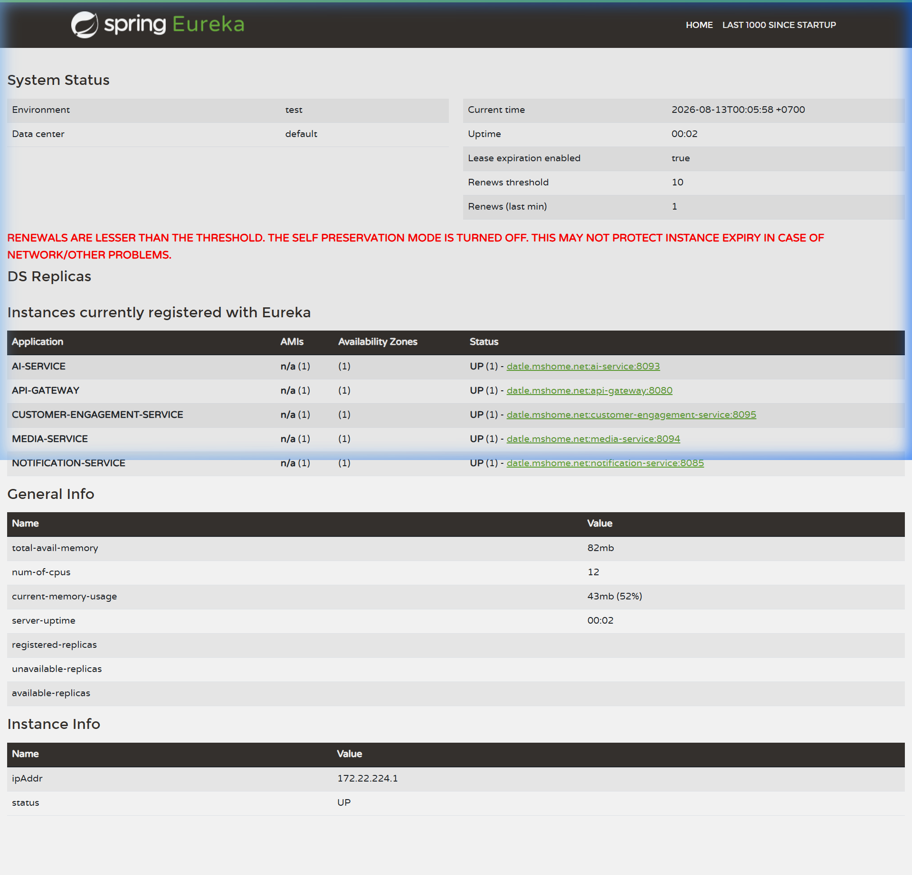

🌐 **Language**: **English** | [Tiếng Việt](README.vi.md)

---

# MelodyShop Microservices Monorepo 🎵

[](https://www.oracle.com/java/)
[](https://spring.io/projects/spring-boot)
[](https://spring.io/projects/spring-cloud)
[](https://mariadb.org/)
[](https://www.elastic.co/)
[](https://www.elastic.co/elk-stack)
[](https://github.com/features/actions)
[](https://www.docker.com/)
[](https://deepmind.google/technologies/gemini/)

Enterprise-grade E-Commerce Backend Microservices Architecture for **MelodyShop** (Musical Instruments & Audio Gear Platform). The repository powers **13 decoupled microservices**, adhering to **Database-per-Service** design patterns, centralized dynamic service registration with **Netflix Eureka**, dynamic API routing & security with **Spring Cloud API Gateway**, and automated distributed logging & observability via **ELK Stack**.

---

## 🚀 Key Engineering & Architecture Highlights

| Engineering Domain | Technology / Tool | Architectural Capability & Highlights |
|---|---|---|
| **Service Registry & Discovery** | **Netflix Eureka Server** (`:8761`) | Zero-hardcoding dynamic service registry, healthcheck monitoring, and instant client discovery for all 13 instances. |
| **API Gateway & Central Security** | **Spring Cloud Gateway** (`:8080`) | Single entry-point API Gateway featuring Centralized JWT Authentication Filter, Dynamic Route Forwarding, CORS, and Rate Limiting. |
| **Centralized Logging & Observability** | **ELK Stack** (`docker-compose.elk.yml`) | Logstash TCP/UDP log collection appender, Elasticsearch 8.13 index, and Kibana Analytics Dashboard (`:5601`) for real-time trace diagnosis. |
| **Automated CI/CD Pipeline** | **GitHub Actions** (`ci.yml`) | Continuous Integration pipeline automating multi-module Java 21 Maven builds, unit test executions, and GHCR Docker Image distribution. |
| **Database Schema Versioning** | **Flyway Migration** (22+ Scripts) | Version-controlled SQL migration scripts guaranteeing zero-downtime database evolution and automated seed data provision. |
| **Inter-Service Communication** | **Spring Cloud OpenFeign** | Declarative type-safe REST Clients connecting Order, Cart, Inventory, Payment, and Notification services. |
| **High-Performance DTO Mapping** | **MapStruct** | Compile-time bean mapping generator with zero CPU overhead, ensuring clean separation between Entities and API DTOs. |
| **Interactive API Documentation** | **Swagger / OpenAPI 3** | Auto-generated interactive API documentation UI (`/swagger-ui.html`) per microservice module. |
| **Biometrics & Smart AI Assistance** | **Gemini 2.0 / Ollama & Face Auth** | Intelligent AI Instrument Shopping Assistant (LLM) combined with Facial Recognition Biometric Authentication. |

---

## 🏛️ High-Level Microservices Architecture Diagram

```mermaid
graph TD
    classDef client fill:#e0f2fe,stroke:#0284c7,stroke-width:2px,color:#0369a1;
    classDef gateway fill:#f3e8ff,stroke:#9333ea,stroke-width:2px,color:#6b21a8;
    classDef infra fill:#fef3c7,stroke:#d97706,stroke-width:2px,color:#92400e;
    classDef core fill:#dcfce7,stroke:#16a34a,stroke-width:2px,color:#15803d;
    classDef engagement fill:#fce7f3,stroke:#db2777,stroke-width:2px,color:#9d174d;
    classDef ai fill:#ffedd5,stroke:#ea580c,stroke-width:2px,color:#c2410c;
    classDef db fill:#f1f5f9,stroke:#64748b,stroke-width:1px,color:#334155;

    Client["💻 Client Applications<br/>(React SPA / Mobile / Postman)"]:::client
    
    subgraph Infrastructure ["🛡️ Infrastructure & Observability"]
        Gateway["🌐 API Gateway<br/>(:8080)<br/><i>JWT Auth Filter & Routing</i>"]:::gateway
        Eureka["🔍 Eureka Server<br/>(:8761)<br/><i>Service Registry & Discovery</i>"]:::infra
        ELK["📊 ELK Stack<br/>(:5601 Kibana)<br/><i>Logstash + Elasticsearch</i>"]:::infra
    end

    subgraph CoreServices ["🛒 Core E-Commerce Microservices"]
        Auth["🔑 Auth Service (:8081)"]:::core
        User["👤 User Service (:8084)"]:::core
        Product["🎸 Product Service (:8082)"]:::core
        Inventory["📦 Inventory Service (:8086)"]:::core
        Cart["🛒 Cart Service (:8091)"]:::core
        Order["📜 Order Service (:8092)"]:::core
        Payment["💳 Payment Service (:8087)"]:::core
    end

    subgraph SupportingServices ["📣 Search & Media Microservices"]
        Notif["📧 Notification Service (:8085)"]:::engagement
        Engage["⭐ Customer Engagement (:8088)"]:::engagement
        Search["🔎 Search Service (:8090)"]:::engagement
        Media["🖼️ Media Service (:8089)"]:::engagement
    end

    subgraph AIServices ["🤖 Smart AI & Biometrics"]
        AIService["🧠 AI Service (:8093)<br/><i>Gemini 2.0 / Ollama</i>"]:::ai
        FaceService["📸 Face Service (:8097)<br/><i>Facial Auth Recognition</i>"]:::ai
    end

    subgraph StorageLayer ["🗄️ Persistence & Infrastructure Layer"]
        AuthDB[("auth_db")]:::db
        UserDB[("user_db")]:::db
        ProductDB[("product_db")]:::db
        InventoryDB[("inventory_db")]:::db
        CartDB[("cart_db")]:::db
        OrderDB[("order_db")]:::db
        PaymentDB[("payment_db")]:::db
        ESDB[("Elasticsearch 8.13")]:::db
        Cloudinary[("Cloudinary CDN")]:::db
    end

    %% Client Interactions
    Client -->|HTTP / REST| Gateway

    %% Discovery Registers
    Gateway <-->|Register & Discover| Eureka
    Auth <--> Eureka
    User <--> Eureka
    Product <--> Eureka
    Inventory <--> Eureka
    Cart <--> Eureka
    Order <--> Eureka
    Payment <--> Eureka
    Notif <--> Eureka
    Engage <--> Eureka
    Search <--> Eureka
    Media <--> Eureka
    AIService <--> Eureka

    %% Gateway Routing
    Gateway -->|/api/auth/**| Auth
    Gateway -->|/api/users/**| User
    Gateway -->|/api/products/**| Product
    Gateway -->|/api/inventory/**| Inventory
    Gateway -->|/api/cart/**| Cart
    Gateway -->|/api/orders/**| Order
    Gateway -->|/api/payments/**| Payment
    Gateway -->|/api/notifications/**| Notif
    Gateway -->|/api/engagement/**| Engage
    Gateway -->|/api/search/**| Search
    Gateway -->|/api/media/**| Media
    Gateway -->|/api/ai/**| AIService

    %% Inter-service Feign Communication
    Order -.->|OpenFeign| Cart
    Order -.->|OpenFeign| Inventory
    Order -.->|OpenFeign| Product
    Order -.->|OpenFeign| Payment
    Order -.->|OpenFeign| Notif
    Auth -.->|HTTP Client| FaceService

    %% Log Appender
    CoreServices -.->|TCP Log Appender| ELK

    %% Service Database Attachments
    Auth --> AuthDB
    User --> UserDB
    Product --> ProductDB
    Inventory --> InventoryDB
    Cart --> CartDB
    Order --> OrderDB
    Payment --> PaymentDB
    Search --> ESDB
    Media --> Cloudinary
```



---

## 📊 Live Eureka Service Registry Showcase

The microservices dynamically register with the **Netflix Eureka Server** (`http://localhost:8761`) upon startup. Below is an authentic live screenshot captured directly from the running Eureka Registry Server in local development environment (showing active microservices including `API-GATEWAY`, `AI-SERVICE`, `NOTIFICATION-SERVICE`, `MEDIA-SERVICE`, `CUSTOMER-ENGAGEMENT-SERVICE` registered UP):



---

## 🛠️ Comprehensive 13 Microservices Directory

The system is decomposed into 13 standalone microservices for maximal scalability, domain isolation, and maintainability:

| # | Service Name | Port | Database / Storage | Key Responsibilities & Engineering Features | Primary API Route |
|---|---|:---:|---|---|---|
| **1** | **`eureka-server`** | `8761` | In-Memory Registry | Netflix Eureka Service Discovery Server providing dynamic service lookup and health checks for all 13 backend instances. | `/` |
| **2** | **`api-gateway`** | `8080` | None | Spring Cloud API Gateway serving as the single entry point with Centralized JWT Auth Filter, Dynamic Route Resolution, and Rate Limiting. | `/api/**` |
| **3** | **`auth-service`** | `8081` | MariaDB (`auth_db`) | User identity management, User Registration, OAuth2/JWT issuance & validation (Access/Refresh Tokens), and RBAC security. | `/api/auth/**` |
| **4** | **`user-service`** | `8084` | MariaDB (`user_db`) | Detailed user profile management, shipping address book, user preferences, and administrative user operations. | `/api/users/**` |
| **5** | **`product-service`** | `8082` | MariaDB (`product_db`) | Catalog management, multi-tier categories, brand specifications, product variants, and dynamic specs JSON attributes. | `/api/products/**` |
| **6** | **`inventory-service`** | `8086` | MariaDB (`inventory_db`) | Warehouse management, multi-location stock reservation/deduction, low-stock threshold alerts, and serial tracking. | `/api/inventory/**` |
| **7** | **`cart-service`** | `8091` | MariaDB (`cart_db`) | Real-time shopping cart calculation, cart item lifecycle management, and user session synchronization. | `/api/cart/**` |
| **8** | **`order-service`** | `8092` | MariaDB (`order_db`) | End-to-end Order Orchestration, lifecycle state machine (`PENDING` ➔ `DELIVERED`), revenue analytics, and Feign integration. | `/api/orders/**` |
| **9** | **`payment-service`** | `8087` | MariaDB (`payment_db`) | Payment gateway integrations (VietQR/SePay, Stripe, COD), webhook payload handlers, and transaction audit trails. | `/api/payments/**` |
| **10** | **`notification-service`**| `8085` | In-Memory Log | Async email dispatching (Welcome templates, Order placement confirmation, OTP Password Reset) via Spring Boot Mail (SMTP). | `/api/notifications/**`|
| **11** | **`customer-engagement-service`** | `8088` | MariaDB (`engagement_db`)| Product reviews & verified ratings, customer wishlists, and promotional coupon/voucher validation rules. | `/api/engagement/**` |
| **12** | **`search-service`** | `8090` | Elasticsearch 8.13 | Full-text search engine, multi-faceted filtering (category, price range, brand, rating), and autocomplete index. | `/api/search/**` |
| **13** | **`ai-service` & `face-service`** | `8093` / `8097` | Vector DB / AI Engine | Smart AI Instrument Shopping Assistant (Gemini 2.0 / Ollama Llama 3.2) & Facial Recognition Biometric Auth Service. | `/api/ai/**` |

---

## 🗄️ Database-per-Service & Flyway Versioning

The architecture enforces strict **Database-per-Service** isolation. Schema evolutions and seed data are version-controlled via **Flyway Migrations** (22+ versioned SQL scripts):

```
melodyshop-microservices/
├── 🔑 auth-db        (MariaDB Port 3307) -> Flyway: V1__init_auth.sql (Users, Roles, RefreshTokens)
├── 👤 user-db        (MariaDB Port 3310) -> Flyway: V1__init_user.sql (Profiles, Addresses)
├── 🎸 product-db     (MariaDB Port 3308) -> Flyway: V1__init_product.sql (Categories, Brands, Variants)
├── 📦 inventory-db   (MariaDB Port 3309) -> Flyway: V1__init_inventory.sql (Warehouses, Stock, Logs)
├── 🛒 cart-db        (MariaDB Port 3313) -> Flyway: V1__init_cart.sql (Carts, Items)
├── 📜 order-db       (MariaDB Port 3312) -> Flyway: V1__init_order.sql (Orders, Items, Timeline)
├── 💳 payment-db     (MariaDB Port 3311) -> Flyway: V1__init_payment.sql (Payments, Webhook logs)
└── 🔎 search-index   (Elasticsearch 9200)-> Replicated Product Index
```

---

## 🚀 Local Execution & Quick Start Guide

### Step 1: Initialize Environment Variables
```bash
cp .env.example .env
```

### Step 2: Launch Stack with Docker Compose

- **Standard Mode (Microservices + Databases)**:
  ```bash
  docker-compose up -d --build
  ```

- **Observability Mode (Microservices + ELK Stack + Kibana)**:
  ```bash
  docker-compose -f docker-compose.yml -f docker-compose.elk.yml up -d
  ```

### Step 3: Verify Infrastructure Services
- **Eureka Registry Dashboard**: [http://localhost:8761](http://localhost:8761)
- **Kibana Log Analytics (ELK Mode)**: [http://localhost:5601](http://localhost:5601)
- **API Gateway Base Endpoint**: `http://localhost:8080`

---

## 🧪 Comprehensive API Directory

All API calls are routed through the **API Gateway**: `http://localhost:8080`.

### 1. Auth Service (`/api/auth/**`)
| Method | Endpoint | Description | Authorization |
|:---:|:---|:---|:---:|
| **POST** | `/api/auth/register` | Register new customer account | Public |
| **POST** | `/api/auth/login` | Authenticate & issue Access Token + Refresh Token | Public |
| **POST** | `/api/auth/refresh` | Issue new Access Token using valid Refresh Token | Refresh Token |
| **POST** | `/api/auth/logout` | Revoke user refresh token | Bearer Token |
| **GET** | `/api/auth/me` | Fetch active user credentials | Bearer Token |

### 2. User Service (`/api/users/**`)
| Method | Endpoint | Description | Authorization |
|:---:|:---|:---|:---:|
| **GET** | `/api/users/profile` | Retrieve customer profile details | Bearer Token |
| **PUT** | `/api/users/profile` | Update profile information (Name, Phone, Avatar) | Bearer Token |
| **GET** | `/api/users/addresses` | List customer shipping address book | Bearer Token |
| **POST** | `/api/users/addresses` | Add new shipping address entry | Bearer Token |

### 3. Product Service (`/api/products/**`)
| Method | Endpoint | Description | Authorization |
|:---:|:---|:---|:---:|
| **GET** | `/api/products` | Paginated product list (Filtering & Sorting) | Public |
| **GET** | `/api/products/{id}` | Detailed product view with specs & variants | Public |
| **GET** | `/api/products/categories` | Fetch category tree hierarchy | Public |
| **POST** | `/api/products` | (Admin) Create new product entry | Admin Token |

### 4. Cart & Order Service (`/api/cart/**` & `/api/orders/**`)
| Method | Endpoint | Description | Authorization |
|:---:|:---|:---|:---:|
| **GET** | `/api/cart` | Retrieve current user shopping cart | Bearer Token |
| **POST** | `/api/cart/items` | Add product variant item to cart | Bearer Token |
| **POST** | `/api/orders` | Checkout cart & orchestrate order creation | Bearer Token |
| **GET** | `/api/orders/{id}` | Track order details & delivery status timeline | Bearer Token |

### 5. Payment & AI Service (`/api/payments/**` & `/api/ai/**`)
| Method | Endpoint | Description | Authorization |
|:---:|:---|:---|:---:|
| **POST** | `/api/payments/vietqr` | Generate VietQR banking transfer QR code | Bearer Token |
| **POST** | `/api/ai/chat` | Chat with AI Shopping Assistant for instrument recommendations | Public / User |

---

## 📂 Postman Collection & Integration Tests

The root directory contains a pre-configured Postman test suite: **`MelodyShop_Postman_Collection.json`**.
1. **Import** `MelodyShop_Postman_Collection.json` into Postman.
2. Recommended execution sequence:
   `1. Register` ➔ `2. Login` (Postman automatically stores `accessToken` in Environment Variables) ➔ `3. Test Profile/Cart/Orders`.

---

💻 **MelodyShop Microservices** — *Production-grade, highly scalable, cloud-native architecture.*
