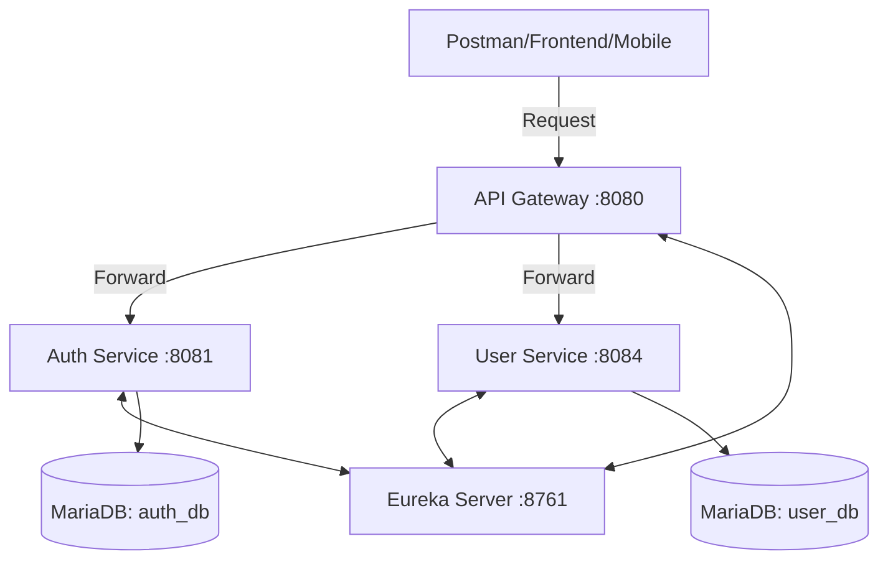

# 🏗 MelodyShop System Design & Architecture

Chào mừng bạn đến với tài liệu kỹ thuật của **MelodyShop**. Tài liệu này cung cấp cái nhìn toàn diện về cấu trúc, cơ sở dữ liệu và các luồng xử lý chính trong hệ thống.

---

## 🛰 1. Tổng quan Kiến trúc (High-Level Architecture)

Hệ thống được thiết kế theo mô hình **Microservices** hiện đại, sử dụng hệ sinh thái Spring Cloud.

### Thành phần chính:
- **API Gateway**: Cửa ngõ duy nhất. Xử lý bảo mật (JWT) và điều hướng request.
- **Eureka Server**: Trung tâm điều phối, giúp các service tự tìm thấy nhau (Service Discovery).
- **Auth Service**: Quản lý Tài khoản, Phân quyền (RBAC), và Token.
- **User Service**: Quản lý Thông tin cá nhân, Địa chỉ giao hàng.

---

## 💾 2. Thiết kế Cơ sở dữ liệu (Database Design)

Hệ thống tuân thủ nguyên tắc **Database-per-Service**. Dưới đây là mô tả chi tiết của toàn bộ 29 bảng.

### 🔐 2.1. Auth Service Database (`auth_db`)

| Bảng | Cột chính | Ghi chú |
|:--- |:--- |:--- |
| **users** | `id`, `email`, `password_hash`, `full_name`, `phone`, `is_active`, `loyalty_points` | Thực thể người dùng chính. |
| **roles** | `id`, `name` (CUSTOMER, ADMIN), `description`, `is_system` | Danh mục vai trò. |
| **permissions**| `id`, `role_id`, `resource`, `action` | Phân quyền chi tiết (RBAC). |
| **user_roles** | `user_id`, `role_id` | Bảng nối N-N. |
| **addresses** | `id`, `user_id`, `province`, `district`, `ward`, `detail`, `is_default` | Sổ địa chỉ giao hàng. |
| **refresh_tokens**| `user_id`, `token_hash`, `device_info`, `expires_at`, `is_revoked` | Quản lý phiên đăng nhập. |

---

### 📦 2.2. Product Service Database (`product_db`)

| Bảng | Cột chính | Ghi chú |
|:--- |:--- |:--- |
| **categories** | `id`, `parent_id`, `name`, `slug`, `image_url`, `sort_order` | Phân cấp danh mục (Cây). |
| **brands** | `id`, `name`, `slug`, `logo_url`, `country` | Thương hiệu nhạc cụ. |
| **products** | `id`, `category_id`, `brand_id`, `sku`, `name`, `specs` (JSON), `base_price`, `status` | Thông tin SP nòng cốt. |
| **variants** | `id`, `product_id`, `sku`, `price`, `color`, `size` | Biến thể (Màu, kích cỡ). |
| **images** | `id`, `product_id`, `url`, `is_primary` | Thư viện ảnh SP. |
| **reviews** | `id`, `product_id`, `user_id`, `rating` (1-5), `comment`, `is_verified` | Đánh giá từ khách hàng. |

---

### 🛒 2.3. Order Service Database (`order_db`)

| Bảng | Cột chính | Ghi chú |
|:--- |:--- |:--- |
| **carts** | `id`, `user_id`, `session_id`, `expires_at` | Giỏ hàng tạm thời. |
| **cart_items** | `cart_id`, `product_id`, `variant_id`, `quantity`, `unit_price` | SP trong giỏ. |
| **coupons** | `code`, `type`, `value`, `min_order`, `max_uses`, `expires_at` | Mã giảm giá. |
| **orders** | `id`, `user_id`, `order_code`, `status`, `total_amount`, `ship_address` | Đơn hàng chính thức. |
| **order_items** | `order_id`, `product_name`, `variant_name`, `quantity`, `unit_price`, `serial` | Snapshot dữ liệu lúc mua. |
| **status_logs** | `order_id`, `old_status`, `new_status`, `note`, `changed_by` | Timeline lịch sử đơn. |

---

### 🏭 2.4. Inventory Service Database (`inventory_db`)

| Bảng | Cột chính | Ghi chú |
|:--- |:--- |:--- |
| **warehouses** | `id`, `name`, `address`, `manager_name`, `is_active` | Danh sách kho vật lý. |
| **inventory** | `warehouse_id`, `product_id`, `quantity`, `reserved_quantity` | Tồn kho thực tế/đặt trước. |
| **inventory_logs**| `inventory_id`, `action` (import/sale), `quantity_change`, `note` | Lịch sử nhập xuất. |
| **serial_numbers**| `product_id`, `serial_no`, `status` (in_stock/sold), `warranty_expire` | Quản lý từng sản phẩm. |

---

### 💳 2.5. Các Services khác (Payment, Shipping, Return, Wishlist)

*   **Payment (`payment_db`)**: `payments` (order_id, method, status, amount), `payment_logs` (webhook payloads).
*   **Shipping (`shipping_db`)**: `shipments` (order_id, carrier, tracking_code, status), `shipment_events` (location, description).
*   **Return (`return_db`)**: `returns` (order_id, reason, status, refund_amount), `return_items` (order_item_id, condition).
*   **Wishlist**: `wishlists` (user_id, product_id, added_at).

> [!IMPORTANT]
> **Mối quan hệ liên Database:** Các service liên kết với nhau qua các ID bất biến (`userId`, `productId`, `orderId`). Tính nhất quán được đảm bảo qua gọi API xác thực chéo hoặc kiến trúc hướng sự kiện (Event-Driven).

---

## 🛠 3. Các Luồng Nghiệp vụ Chính (Core Logics)

### 3.1. Xác thực và Bảo mật (JWT Flow)
1. **Gateway** xác thực JWT tập trung.
2. Trích xuất thông tin User và Forward qua Headers (`X-User-Id`, `X-User-FullName`).

### 3.2. JIT (Just-In-Time) Profile Creation
Khi `User Service` nhận request Profile nhưng chưa có record trong DB, nó sẽ tự động khởi tạo dựa trên thông tin từ Gateway Header.

---

## 🤖 4. Gợi ý dành cho AI Assistant

AI nên đọc file này trước tiên để hiểu cấu trúc quan hệ. Lưu ý:
- Phân biệt giữa **ID thật** (Identity) và **ID tham chiếu** (Reference IDs) giữa các DB.
- Chú ý các trường **JSON** (`specs`, `payload`) để xử lý dữ liệu động.

---

## 🚀 5. Lộ trình Phát triển (Next Steps)
1. Phát triển **Product Service** (Catalog).
2. Phát triển **Order & Cart Service**.
3. Tích hợp **Inventory & Serial Tracking**.
4. Kết nối **Payment Gateway**.
