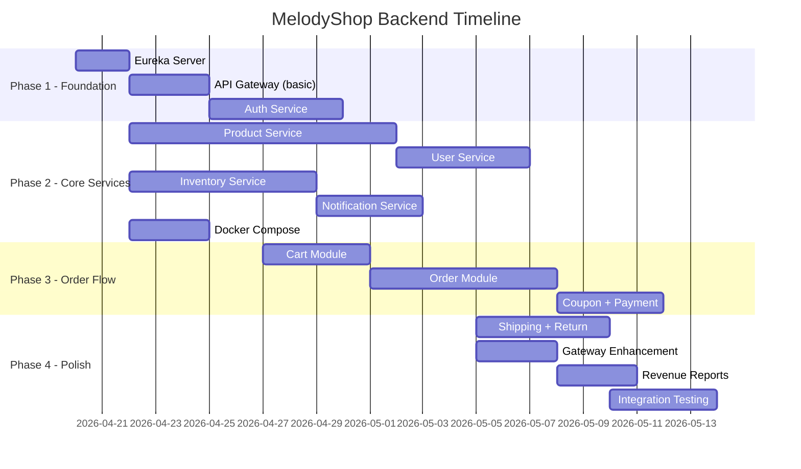

# 🎵 MelodyShop Backend — Phân Chia Công Việc Cho 4 Thành Viên

## Tổng Quan Hệ Thống

Hệ thống MelodyShop bao gồm **9 thành phần backend** cần xây dựng:

| # | Thành phần | Port | Độ phức tạp | Số bảng DB |
|---|-----------|------|-------------|------------|
| 1 | **Eureka Server** | 8761 | ⭐ Thấp | 0 |
| 2 | **API Gateway** | 8080 | ⭐⭐⭐ Cao | 0 |
| 3 | **Auth Service** | 8081 | ⭐⭐⭐ Cao | 5 bảng |
| 4 | **Product Service** | 8082 | ⭐⭐⭐ Cao | 6 bảng |
| 5 | **Order Service** | 8083 | ⭐⭐⭐⭐ Rất cao | 6 bảng |
| 6 | **User Service** | 8084 | ⭐⭐ Trung bình | 2 bảng |
| 7 | **Notification Service** | 8085 | ⭐⭐ Trung bình | 1 bảng |
| 8 | **Inventory Service** | 8086 | ⭐⭐⭐ Cao | 4 bảng |
| 9 | **Docker Compose** | — | ⭐⭐ Trung bình | — |

---

## 📋 Phân Chia Công Việc

### 👤 Thành Viên 1 — "Hạ tầng & Xác thực"
> **Eureka Server + API Gateway + Auth Service**

Người này chịu trách nhiệm xây dựng **xương sống** của toàn bộ hệ thống. Các service khác đều phụ thuộc vào phần này → cần hoàn thành **sớm nhất**.

---

#### 1️⃣ Eureka Server (Port 8761)
- Cấu hình Netflix Eureka Service Registry
- Health check endpoint
- Dashboard quản lý (Eureka có sẵn UI)

#### 2️⃣ API Gateway (Port 8080)
- Spring Cloud Gateway routing configuration
- JWT Authentication Filter (xác thực token tại Gateway)
- Route definitions cho tất cả services:
  ```
  /api/auth/**    → auth-service
  /api/products/** → product-service
  /api/orders/**  → order-service
  /api/users/**   → user-service
  /api/inventory/** → inventory-service
  /api/notifications/** → notification-service
  ```
- CORS configuration (cho ReactJS frontend)
- Rate Limiting filter
- Load Balancing qua Eureka

#### 3️⃣ Auth Service (Port 8081) — Database: `auth_db`

**Bảng cần tạo:** `users`, `roles`, `permissions`, `user_roles`, `refresh_tokens`

**API Endpoints:**

| Method | Endpoint | Mô tả | Quyền |
|--------|----------|-------|-------|
| POST | `/api/auth/register` | Đăng ký tài khoản | Public |
| POST | `/api/auth/login` | Đăng nhập, trả JWT | Public |
| POST | `/api/auth/refresh` | Làm mới access token | Public |
| POST | `/api/auth/logout` | Thu hồi refresh token | CUSTOMER, ADMIN |
| GET | `/api/auth/validate` | Validate JWT (cho Gateway gọi) | Internal |
| GET | `/api/auth/me` | Lấy thông tin user hiện tại | CUSTOMER, ADMIN |

**Công việc chi tiết:**
- [ ] Entity: User, Role, Permission, UserRole, RefreshToken
- [ ] Spring Security + JWT configuration
- [ ] BCrypt password encoding (cost=12)
- [ ] JWT access token (15 min) + refresh token (7 days)
- [ ] Token validation endpoint cho API Gateway
- [ ] Flyway migration scripts cho `auth_db`
- [ ] Global exception handler
- [ ] Seed data: 3 roles (GUEST, CUSTOMER, ADMIN) + admin account mặc định

**Ước tính khối lượng:** ⭐⭐⭐⭐ — Nặng (nhưng cần xong sớm nhất)

---

### 👤 Thành Viên 2 — "Sản phẩm & Catalog"
> **Product Service + User Service**

Phụ trách toàn bộ quản lý sản phẩm (nghiệp vụ lớn nhất của hệ thống e-commerce) và quản lý hồ sơ người dùng.

---

#### 1️⃣ Product Service (Port 8082) — Database: `product_db`

**Bảng cần tạo:** `categories`, `brands`, `products`, `product_variants`, `product_images`, `reviews`

**API Endpoints:**

| Method | Endpoint | Mô tả | Quyền |
|--------|----------|-------|-------|
| GET | `/api/products` | Danh sách SP (phân trang, lọc, sắp xếp) | Public |
| GET | `/api/products/{id}` | Chi tiết SP | Public |
| GET | `/api/products/slug/{slug}` | Chi tiết SP theo slug | Public |
| GET | `/api/products/featured` | SP nổi bật (trang chủ) | Public |
| POST | `/api/products` | Thêm SP mới | ADMIN |
| PUT | `/api/products/{id}` | Cập nhật SP | ADMIN |
| DELETE | `/api/products/{id}` | Soft delete SP | ADMIN |
| GET | `/api/categories` | Danh sách danh mục (cây) | Public |
| POST | `/api/categories` | Thêm danh mục | ADMIN |
| PUT | `/api/categories/{id}` | Sửa danh mục | ADMIN |
| DELETE | `/api/categories/{id}` | Xóa danh mục | ADMIN |
| GET | `/api/brands` | Danh sách thương hiệu | Public |
| POST | `/api/brands` | Thêm thương hiệu | ADMIN |
| PUT | `/api/brands/{id}` | Sửa thương hiệu | ADMIN |
| DELETE | `/api/brands/{id}` | Xóa thương hiệu | ADMIN |
| GET | `/api/products/{id}/reviews` | Đánh giá của SP | Public |
| POST | `/api/products/{id}/reviews` | Viết đánh giá | CUSTOMER |
| POST | `/api/products/{id}/images` | Upload ảnh SP | ADMIN |
| DELETE | `/api/products/images/{id}` | Xóa ảnh SP | ADMIN |

**Công việc chi tiết:**
- [ ] Entity: Category (self-referencing parent_id), Brand, Product, ProductVariant, ProductImage, Review
- [ ] Product filtering: category, brand, price range, status, is_featured
- [ ] Product sorting: price (asc/desc), newest, popular (review_count)
- [ ] Pagination với Spring Data Pageable
- [ ] Category tree structure (parent → children)
- [ ] Product slug auto-generation
- [ ] Specs lưu dạng JSON (chất liệu, số dây, etc.)
- [ ] Review system: tính avg_rating, review_count tự động
- [ ] Verified purchase check (gọi Order Service qua Feign)
- [ ] Image upload endpoint
- [ ] Flyway migration scripts cho `product_db`

#### 2️⃣ User Service (Port 8084) — Database: `user_db`

> [!NOTE]
> User Service quản lý **hồ sơ** người dùng (profile, địa chỉ), khác với Auth Service quản lý **xác thực** (login, token). Dữ liệu user_id được chia sẻ qua API, không có FK chéo.

**Bảng cần tạo:** `user_profiles`, `user_addresses` (hoặc dùng chung bảng `user_addresses` từ auth_db thông qua API)

**API Endpoints:**

| Method | Endpoint | Mô tả | Quyền |
|--------|----------|-------|-------|
| GET | `/api/users/profile` | Lấy profile hiện tại | CUSTOMER |
| PUT | `/api/users/profile` | Cập nhật profile | CUSTOMER |
| GET | `/api/users/addresses` | Danh sách địa chỉ | CUSTOMER |
| POST | `/api/users/addresses` | Thêm địa chỉ mới | CUSTOMER |
| PUT | `/api/users/addresses/{id}` | Sửa địa chỉ | CUSTOMER |
| DELETE | `/api/users/addresses/{id}` | Xóa địa chỉ | CUSTOMER |
| PUT | `/api/users/addresses/{id}/default` | Đặt địa chỉ mặc định | CUSTOMER |
| GET | `/api/users` | Danh sách users (Admin) | ADMIN |
| GET | `/api/users/{id}` | Chi tiết user (Admin) | ADMIN |
| PUT | `/api/users/{id}/lock` | Khóa tài khoản | ADMIN |
| PUT | `/api/users/{id}/unlock` | Mở khóa tài khoản | ADMIN |

**Ước tính khối lượng:** ⭐⭐⭐⭐ — Nặng (Product Service phức tạp)

---

### 👤 Thành Viên 3 — "Đơn hàng & Thanh toán"
> **Order Service (bao gồm Cart + Order + Coupon + Payment)**

Phụ trách toàn bộ luồng mua hàng — từ giỏ hàng → đặt hàng → thanh toán → theo dõi trạng thái.

---

#### Order Service (Port 8083) — Database: `order_db` + `payment_db`

**Bảng cần tạo:** `carts`, `cart_items`, `coupons`, `orders`, `order_items`, `order_status_logs`, `payments`, `payment_logs`, `wishlists`

**API Endpoints — Cart:**

| Method | Endpoint | Mô tả | Quyền |
|--------|----------|-------|-------|
| GET | `/api/cart` | Lấy giỏ hàng hiện tại | CUSTOMER |
| POST | `/api/cart/items` | Thêm SP vào giỏ | CUSTOMER |
| PUT | `/api/cart/items/{id}` | Cập nhật số lượng | CUSTOMER |
| DELETE | `/api/cart/items/{id}` | Xóa SP khỏi giỏ | CUSTOMER |
| DELETE | `/api/cart` | Xóa toàn bộ giỏ | CUSTOMER |

**API Endpoints — Order:**

| Method | Endpoint | Mô tả | Quyền |
|--------|----------|-------|-------|
| POST | `/api/orders` | Tạo đơn hàng từ giỏ | CUSTOMER |
| GET | `/api/orders` | Danh sách đơn (Customer) | CUSTOMER |
| GET | `/api/orders/{id}` | Chi tiết đơn | CUSTOMER |
| GET | `/api/orders/{id}/timeline` | Timeline trạng thái | CUSTOMER |
| PUT | `/api/orders/{id}/cancel` | Hủy đơn | CUSTOMER |
| GET | `/api/admin/orders` | Danh sách đơn (Admin, lọc) | ADMIN |
| PUT | `/api/admin/orders/{id}/status` | Cập nhật trạng thái | ADMIN |
| GET | `/api/admin/reports/revenue` | Báo cáo doanh thu | ADMIN |

**API Endpoints — Coupon:**

| Method | Endpoint | Mô tả | Quyền |
|--------|----------|-------|-------|
| POST | `/api/coupons/validate` | Kiểm tra mã giảm giá | CUSTOMER |
| GET | `/api/admin/coupons` | Danh sách coupon | ADMIN |
| POST | `/api/admin/coupons` | Tạo coupon | ADMIN |
| PUT | `/api/admin/coupons/{id}` | Sửa coupon | ADMIN |

**API Endpoints — Payment:**

| Method | Endpoint | Mô tả | Quyền |
|--------|----------|-------|-------|
| POST | `/api/payments` | Tạo giao dịch thanh toán | CUSTOMER |
| GET | `/api/payments/{orderId}` | Trạng thái thanh toán | CUSTOMER |

**API Endpoints — Wishlist:**

| Method | Endpoint | Mô tả | Quyền |
|--------|----------|-------|-------|
| GET | `/api/wishlist` | Danh sách yêu thích | CUSTOMER |
| POST | `/api/wishlist` | Thêm vào yêu thích | CUSTOMER |
| DELETE | `/api/wishlist/{productId}` | Xóa khỏi yêu thích | CUSTOMER |

**Công việc chi tiết:**
- [ ] Cart: CRUD với tự động xóa khi quantity = 0
- [ ] Order creation flow: validate cart → check inventory (Feign) → get product info (Feign) → create order → deduct inventory (Feign) → clear cart → notify (Feign/event)
- [ ] Order code generation: `ORD-yyyyMMdd-xxx`
- [ ] Order status state machine: `pending → confirmed → preparing → shipping → delivered / cancelled / refunded`
- [ ] Order status log timeline
- [ ] Coupon validation (type, value, min_order, max_discount, expiry, max_uses)
- [ ] Payment entity (COD ban đầu, mở rộng VNPay/Momo sau)
- [ ] Revenue report: doanh thu theo ngày/tháng/quý, top products
- [ ] Snapshot product_name, variant_name, unit_price vào order_items
- [ ] OpenFeign clients: InventoryClient, ProductClient, NotificationClient

**Ước tính khối lượng:** ⭐⭐⭐⭐⭐ — Rất nặng (nghiệp vụ phức tạp nhất)

> [!IMPORTANT]
> Order Service là service **phức tạp nhất**, có nhiều giao tiếp liên service. Thành viên này cần phối hợp chặt chẽ với TV1 (Auth), TV2 (Product), TV4 (Inventory & Notification).

---

### 👤 Thành Viên 4 — "Kho hàng, Vận chuyển & Thông báo"
> **Inventory Service + Notification Service + Shipping/Return + Docker Compose**

Phụ trách quản lý tồn kho, vận chuyển, trả hàng, gửi email thông báo và cấu hình Docker cho toàn bộ hệ thống.

---

#### 1️⃣ Inventory Service (Port 8086) — Database: `inventory_db`

**Bảng cần tạo:** `warehouses`, `inventory`, `inventory_logs`, `serial_numbers`

**API Endpoints:**

| Method | Endpoint | Mô tả | Quyền |
|--------|----------|-------|-------|
| GET | `/api/inventory/check` | Kiểm tra tồn kho (cho Order Service gọi) | Internal |
| PUT | `/api/inventory/reserve` | Đặt chỗ khi tạo đơn | Internal |
| PUT | `/api/inventory/deduct` | Trừ tồn kho khi xuất | Internal |
| PUT | `/api/inventory/unreserve` | Hủy đặt chỗ (đơn bị hủy) | Internal |
| GET | `/api/admin/inventory` | Danh sách tồn kho | ADMIN |
| PUT | `/api/admin/inventory/{id}` | Cập nhật tồn kho (nhập hàng) | ADMIN |
| GET | `/api/admin/inventory/low-stock` | Cảnh báo sắp hết hàng | ADMIN |
| GET | `/api/admin/inventory/{id}/logs` | Lịch sử biến động | ADMIN |
| GET | `/api/admin/warehouses` | Danh sách kho | ADMIN |
| POST | `/api/admin/warehouses` | Thêm kho | ADMIN |

**Công việc chi tiết:**
- [ ] Inventory tracking: quantity, reserved_quantity, available = quantity - reserved
- [ ] Reserve/deduct/unreserve workflow cho Order Service
- [ ] Reorder point alert (cảnh báo hàng sắp hết)
- [ ] Inventory logs (audit trail mọi biến động)
- [ ] Serial number tracking (in_stock, sold, returned, warranty_repair)
- [ ] Multi-warehouse support

#### 2️⃣ Notification Service (Port 8085)

**Bảng cần tạo:** `notification_logs`

**API Endpoints:**

| Method | Endpoint | Mô tả | Quyền |
|--------|----------|-------|-------|
| POST | `/api/notifications/email/welcome` | Gửi email chào mừng | Internal |
| POST | `/api/notifications/email/order-confirmation` | Email xác nhận đơn | Internal |
| POST | `/api/notifications/email/order-status` | Email cập nhật trạng thái | Internal |
| POST | `/api/notifications/email/password-reset` | Email reset password | Internal |

**Công việc chi tiết:**
- [ ] Spring Boot Mail configuration (Gmail SMTP hoặc Mailtrap)
- [ ] Email templates (HTML) cho từng loại thông báo
- [ ] Notification log lưu lại từng email đã gửi
- [ ] Retry mechanism khi gửi thất bại

#### 3️⃣ Shipping & Return (thuộc database `shipping_db` + `return_db`)

**Bảng cần tạo:** `shipments`, `shipment_events`, `returns`, `return_items`

**Công việc chi tiết:**
- [ ] Shipment entity + status tracking
- [ ] Shipment events timeline
- [ ] Return request flow (requested → approved/rejected → received → refunded)
- [ ] Return items detail

#### 4️⃣ Docker Compose Configuration

- [ ] `docker-compose.yml` cho toàn bộ stack
- [ ] Database containers: auth-db, product-db, order-db, user-db, inventory-db (MariaDB)
- [ ] Service containers: eureka-server, api-gateway, auth-service, product-service, order-service, user-service, notification-service, inventory-service
- [ ] Network configuration: `backend-network`
- [ ] Health check + depends_on ordering
- [ ] Volume persistence cho databases
- [ ] Environment variables management (`.env` file)
- [ ] `docker-compose.override.yml` cho development

**Ước tính khối lượng:** ⭐⭐⭐⭐ — Nặng (nhiều service nhưng từng cái ít phức tạp hơn)

---

## 📊 Bảng Tổng Hợp Khối Lượng

| Thành viên | Services | Số bảng DB | Số API | Độ phức tạp |
|------------|----------|-----------|--------|-------------|
| **TV1** | Eureka + Gateway + Auth | 5 | ~6 + infra | ⭐⭐⭐⭐ |
| **TV2** | Product + User | 8 | ~20+ | ⭐⭐⭐⭐ |
| **TV3** | Order (Cart+Order+Coupon+Payment+Wishlist) | 9 | ~20+ | ⭐⭐⭐⭐⭐ |
| **TV4** | Inventory + Notification + Shipping/Return + Docker | 8 | ~15+ | ⭐⭐⭐⭐ |

> [!TIP]
> TV3 có khối lượng nặng nhất do Order Service phải **gọi liên service** (Product, Inventory, Notification). Nên để người có kinh nghiệm nhất đảm nhận, hoặc TV1/TV4 hỗ trợ phần Wishlist/Payment.

---

## 🗓️ Thứ Tự Phát Triển (Timeline Đề Xuất)

### Phase 1: Nền tảng (Tuần 1-2)
Tất cả cùng **setup chung** và TV1 hoàn thành hạ tầng:



| Tuần | TV1 | TV2 | TV3 | TV4 |
|------|-----|-----|-----|-----|
| **1** | Eureka + Gateway cơ bản | Setup project + DB schemas | Setup project + DB schemas | Docker Compose + DB containers |
| **2** | Auth Service hoàn chỉnh | Product CRUD (categories, brands) | Cart Module | Inventory CRUD (warehouses, stock) |
| **3** | Gateway JWT filter + routing | Product search/filter/pagination | Order creation flow (Feign calls) | Notification Service (email) |
| **4** | Gateway rate-limit + polish | Reviews + Image upload + User Service | Order status + Coupon + Payment | Shipping + Return |
| **5** | Integration testing | Integration testing | Revenue reports + Integration | Integration testing |

---

## 🤝 Quy Ước Phối Hợp Nhóm

### 1. Cấu trúc Project Chung
Mỗi service là 1 module Spring Boot riêng, nằm trong cùng monorepo:
```
melodyshop-microservices/
├── eureka-server/
├── api-gateway/
├── auth-service/
├── product-service/
├── order-service/
├── user-service/
├── notification-service/
├── inventory-service/
└── docker-compose.yml
```

### 2. Git Workflow
- **Branch naming:** `feature/{service-name}/{feature}` (e.g., `feature/auth-service/jwt-login`)
- Mỗi người làm trên branch riêng, merge vào `develop` qua Pull Request
- Không push trực tiếp lên `main`

### 3. API Contract
> [!IMPORTANT]
> Trước khi code, **cả nhóm phải thống nhất API contract** (request/response format) cho các endpoint giao tiếp liên service:
> - Auth Service → validate endpoint (TV1 ↔ Gateway)
> - Product Service → get product info (TV2 ↔ TV3)
> - Inventory Service → check/reserve/deduct (TV4 ↔ TV3)
> - Notification Service → send email (TV4 ↔ TV3)

### 4. Shared Dependencies
Cả nhóm thống nhất sử dụng cùng phiên bản:
- Spring Boot: **3.2.x**
- Spring Cloud: **2023.0.x**
- Java: **17**
- MariaDB: **10.11**
- Flyway migration

### 5. Response Format Chuẩn
```json
{
  "success": true,
  "message": "Thành công",
  "data": { ... },
  "timestamp": "2026-04-18T17:00:00"
}
```

Lỗi:
```json
{
  "success": false,
  "message": "Không tìm thấy sản phẩm",
  "error": "PRODUCT_NOT_FOUND",
  "timestamp": "2026-04-18T17:00:00"
}
```

---

## ⚠️ Lưu Ý Quan Trọng

> [!WARNING]
> **Dependency Order**: TV1 (Eureka + Gateway + Auth) **phải xong trước** để các service khác đăng ký và giao tiếp được. Nếu TV1 chậm, cả nhóm bị block.

> [!TIP]
> **Giải pháp**: Trong khi TV1 đang làm, các thành viên khác có thể test service của mình **standalone** (không qua Gateway) bằng cách gọi trực tiếp port của service. Khi Gateway xong mới tích hợp.

> [!CAUTION]
> **Database per Service**: Tuyệt đối KHÔNG có foreign key giữa các database. Mọi dữ liệu liên service phải đi qua REST API (OpenFeign). Ví dụ: Order Service lưu `user_id` nhưng KHÔNG có FK đến `auth_db.users`.
